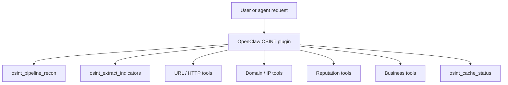
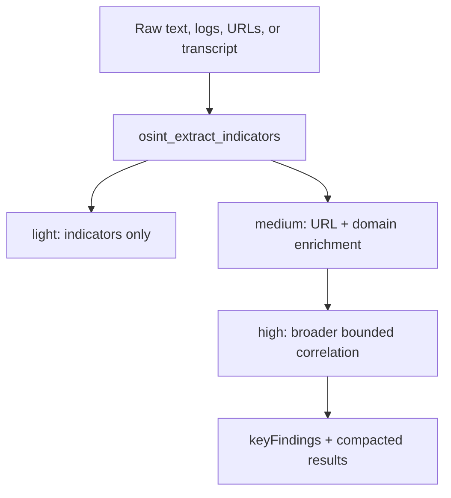
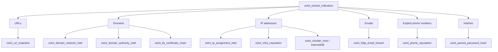
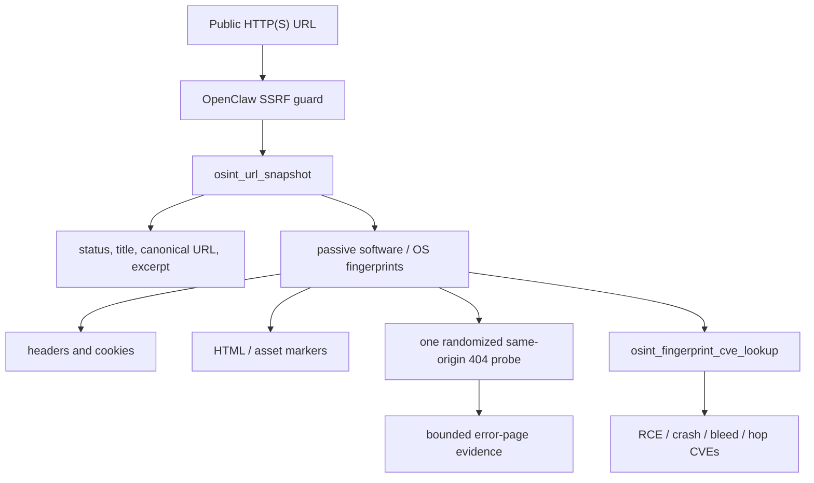
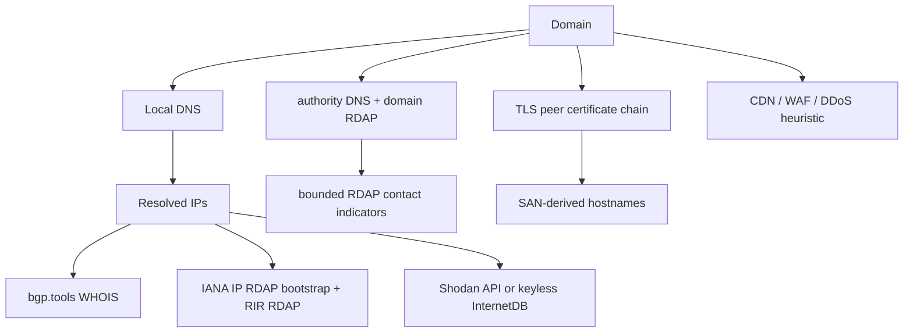
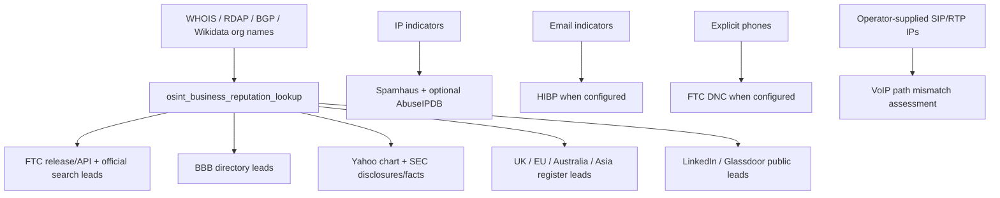
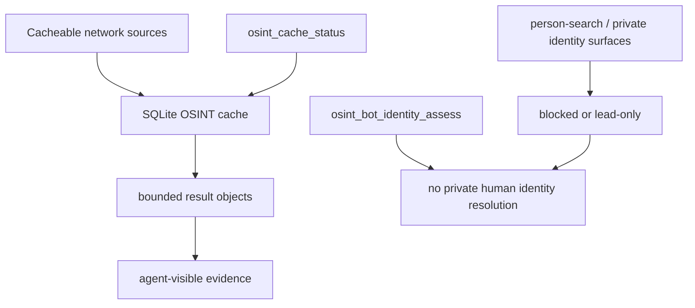

# OpenClaw OSINT

MIT-licensed standalone OpenClaw plugin for bounded public-source OSINT helpers. Current package version: `0.23.1`.

This plugin is intentionally conservative. It provides useful public-source primitives without credentialed scraping, private data broker access, exploit checks, port scans, or shell execution.

Use it when an OpenClaw agent needs to extract indicators, snapshot public web pages, enrich domains and IPs, inspect public business context, or run a bounded recon pipeline. It is designed to produce evidence and leads, not private identity dossiers or vulnerability scans.

## Quick Start

```bash
pnpm install
pnpm build
pnpm pack
openclaw plugins install ./openclaw-osint-0.23.1.tgz
```

Restart the OpenClaw gateway after installing or upgrading the plugin.

Useful smoke checks:

```bash
pnpm test
openclaw plugins list
```

Optional sidecar smoke check for packet-capture URL snapshots:

```bash
npm run setup:sidecar
```

Ask the agent for one of the pipeline shapes:

- `run a light osint pipeline on this text: ...`
- `run a medium osint pipeline check on www.yahoo.com`
- `run a high osint pipeline on this domain and summarize the key findings`

## Configuration

Most tools work without API keys. Keys unlock richer source coverage:

- `SHODAN_API_KEY`: full Shodan host data; otherwise `osint_shodan_host` falls back to keyless InternetDB.
- `HIBP_API_KEY`: Have I Been Pwned email breach checks.
- `FTC_API_KEY`: FTC/Data.gov Do Not Call complaint evidence for explicit US phone indicators.
- `ABUSEIPDB_API_KEY`: AbuseIPDB infrastructure reputation.
- `COMPANIES_HOUSE_API_KEY` or `UK_COMPANIES_HOUSE_API_KEY`: UK Companies House API lookup.
- `ABN_LOOKUP_GUID` or `AU_ABN_LOOKUP_GUID`: Australian ABN Lookup API.
- `OPENCLAW_OSINT_DB_PATH`: override the SQLite cache path.
- `OPENCLAW_OSINT_TARGET_FETCH_BACKEND=podman`: run direct URL snapshot fetches inside an isolated Podman worker namespace and return a bounded tcpdump-derived packet summary.
- `OPENCLAW_OSINT_PODMAN_BIN`: override the Podman binary path when `podman` is not on `PATH`.

No key is required for local indicator extraction, URL snapshots, passive software fingerprint hints, focused NVD/OSV fingerprint CVE lookups, DNS/network enrichment, TLS certificate inspection, Wikidata/Wikipedia context, keyless Shodan InternetDB, or cache status.

## Optional Target-Fetch Sidecar

The Podman target-fetch backend is opt-in. It runs direct URL snapshot fetches inside a disposable worker container and attaches a tcpdump sidecar to that worker's network namespace. The plugin returns only a bounded summary; it does not write `.pcap` files.

### Install Podman

macOS:

```bash
brew install podman
podman machine init --now
podman run --rm quay.io/podman/hello
```

If your macOS Podman install uses Podman Desktop or a custom Homebrew prefix, set `OPENCLAW_OSINT_PODMAN_BIN` to the full `podman` path.

WSL2:

```bash
sudo apt-get update
sudo apt-get install -y podman
podman run --rm quay.io/podman/hello
```

If your distro requires a user service or rootless setup step, complete that first, then rerun the hello check.

Linux:

```bash
# Debian / Ubuntu
sudo apt-get update
sudo apt-get install -y podman

# Fedora
sudo dnf install -y podman

podman run --rm quay.io/podman/hello
```

### Prepare Images And Verify Capture

From the plugin checkout or installed package directory:

```bash
npm run setup:sidecar
```

The setup check pulls:

- `docker.io/curlimages/curl:latest` for the disposable fetch worker
- `docker.io/nicolaka/netshoot:latest` for the tcpdump sidecar

Then it creates a temporary Podman network, starts a worker and sidecar, fetches `https://example.com/`, verifies tcpdump saw packets, and removes the temporary containers/network.

### Enable In OpenClaw

Set these in the OpenClaw gateway environment, then restart the gateway:

```bash
OPENCLAW_OSINT_TARGET_FETCH_BACKEND=podman
OPENCLAW_OSINT_PODMAN_BIN=podman
```

Use the absolute Podman path if `podman` is not on the gateway process `PATH`.

### Operational Notes

- No raw pcaps are persisted. The plugin reads bounded tcpdump text logs from the sidecar and removes the sidecar, worker, and temporary network in cleanup.
- tcpdump runs with `-nn`, so it does not perform reverse DNS or service-name resolution.
- Redirect following is disabled in the Podman backend so a public target cannot redirect the worker into a private/internal address after preflight validation.
- The backend blocks localhost, `.local`, `.internal`, private, link-local, documentation, multicast, and other special-use targets before starting the container fetch.
- If setup fails, leave `OPENCLAW_OSINT_TARGET_FETCH_BACKEND` unset; URL snapshots fall back to the normal OpenClaw SSRF-guarded fetch path.

## Flow

### Request Routing



### Pipeline Effort Levels



### Indicator Fan-Out



### URL And Fingerprint Flow



### Domain And Network Flow



### Business And Reputation Flow



### Cache And Guardrails



Pipeline effort levels:

- `light`: extract indicators only, no network lookups
- `medium`: extract indicators, then enrich bounded URLs, domains, and Wikidata/Wikipedia public-knowledge context
- `high`: extract indicators, enrich URLs/domains, then correlate TLS certificate chains, DNS-discovered IPs, RIR allocation records, Shodan host summaries, focused fingerprint CVE lookups, Wikidata/Wikipedia context, WHOIS/RDAP/BGP-derived business names, professional/workplace/disclosure leads, RDAP-derived emails, and explicit input phones into reputation checks. Host indicators are aggregated once from input domains, email domains, TLS SANs, Shodan hostnames, and related host sources.

## Tools

### `osint_extract_indicators`

Extracts indicators from supplied text without network access.

Returns:

- URLs
- domains
- IPv4 addresses
- email addresses present in the input
- social handles present in the input
- common cryptographic hashes

### `osint_url_snapshot`

Fetches one public HTTP(S) URL through OpenClaw's SSRF guard and returns bounded metadata plus passive fingerprint hints:

- HTTP status and final URL
- content type
- page title
- description
- canonical URL
- bounded body excerpt wrapped as untrusted external content
- optional passive software/framework/OS hints from headers, cookies, page markers, and one randomized same-origin 404 probe
- bounded 404 error-page excerpt when fingerprinting is enabled
- optional `networkCapture` summary when `OPENCLAW_OSINT_TARGET_FETCH_BACKEND=podman` is enabled

Arguments:

- `url`: public HTTP(S) URL to fetch
- `maxExcerptChars`: body excerpt cap
- `includeFingerprint`: defaults to `true`; set `false` for metadata-only fetches
- `maxErrorProbeChars`: cap for the 404 probe excerpt

Fingerprint output is evidence, not proof. Treat OS detection as weak unless the server directly exposes it in a banner or error page.

The tool returns passive fingerprint data under `fingerprint.fingerprints`, with optional 404 probe details under `fingerprint.errorProbe`. There is no top-level `fingerprints` array.

When the Podman backend is enabled, the plugin runs the initial URL fetch inside a disposable worker container and attaches a tcpdump sidecar to that worker's network namespace. Returned capture data is summarized and bounded: DNS queries, remote TCP endpoint, SYN-to-SYN/ACK timing, retransmit count, payload byte counts, packet counts, and a small packet-line sample. Raw pcap data is not returned to the model. Redirect following is intentionally disabled in this backend so a target cannot bounce the worker into a private/internal address after preflight validation.

### `osint_pipeline_recon`

Runs bounded recon from raw text by effort level:

- `light`: local indicator extraction only
- `medium`: URL snapshots, domain network intel, and compact public-knowledge context
- `high`: medium plus TLS certificate chain inspection, CDN/DDoS protection detection, authority DNS/RDAP, RIR IP assignment RDAP, Shodan host summaries for input or DNS-discovered IPs, focused fingerprint CVE lookups for concrete passive software versions, business reputation/professional/workplace/disclosure leads for WHOIS/RDAP/BGP/Wikidata-derived organization names, infrastructure reputation for input or DNS-discovered IPs, HIBP email checks for input or RDAP-derived emails, phone reputation for explicit input phone indicators, and pwned-password hash checks where indicators exist

The tool accepts `text` as the canonical input and `target` as an alias for model/tool-search turns that phrase the input as a target URL, domain, actor, or indicator list.

The pipeline deduplicates indicators through `osint_extract_indicators`, applies `maxLookups` caps per indicator class, and returns stage-labeled results. URL stages include the same passive fingerprint hints as `osint_url_snapshot`. HIBP email checks still require `HIBP_API_KEY`; missing keys return tool errors instead of blocking the rest of the pipeline. Shodan host checks use the full API when `SHODAN_API_KEY` exists and fall back to keyless InternetDB when it does not. RDAP-derived contact indicators and business-source hits are reputation inputs only, not identity proof or complete complaint history. `crt.sh` remains available through `osint_crtsh_domain`, but high-effort pipeline reports it as a deferred optional source because the public service is often slow or unavailable.

High-effort pipeline output keeps expanded hostnames in one canonical place: `results.derivedIndicators.hosts`. Stage-level results avoid repeating those hostnames back into the agent context.

High-effort pipeline runs `osint_fingerprint_cve_lookup` only when URL snapshots produce concrete software/framework versions. Versionless or unmapped fingerprints are skipped instead of broadening into noisy CVE searches.

High-effort pipeline also returns `results.businessReputationSummary` before compacted `results.businessReputation`, so exact BBB misses and related BBB hits survive tool-output truncation.

High-effort pipeline self-compacts oversized result objects before returning them to OpenClaw. It preserves top-level findings and reports omitted per-stage counts instead of relying on downstream truncation. RDAP-derived phone contacts remain visible as derived indicators, but FTC phone reputation runs only for explicit phone-like input indicators.

For agent-facing answers, prefer `keyFindings.execution.phoneReputationRan` over the stage list when deciding whether FTC lookup actually ran, and prefer `limits.outputTruncationMarkerPresent` over compaction fields when deciding whether downstream truncation occurred.

Agent answer guidance:

- Lead with `keyFindings` when present, then cite specific stage evidence.
- Do not claim a source ran just because a related indicator exists; check the stage result or execution flags.
- Treat `businessReputationSummary` as the compact business view when full stage output is truncated.
- Treat `derivedIndicators` as correlation inputs, not facts about ownership or identity.
- Say when an optional keyed source was unavailable or fell back to a keyless mode.

### `osint_cdn_ddos_detect`

Inspects a public URL or domain for CDN, WAF, and DDoS-protection signals.

Evidence sources:

- selected HTTP response headers such as `server`, `via`, `cf-ray`, `x-cache`, `x-amz-cf-*`, `x-sucuri-*`, and similar edge headers
- DNS/BGP ASN names from domain network intel
- TLS certificate issuer, subject, and SAN metadata
- observed hostnames from related stage data

Recognized provider families include Cloudflare, Akamai, Fastly, Amazon CloudFront, Imperva, Sucuri, Google Cloud CDN, Azure Front Door, and Bunny CDN. Results include provider, category, confidence, and evidence snippets. Detection is heuristic; no match is not proof of no protection.

### `osint_fingerprint_cve_lookup`

Looks up RCE and adjacent crash, bleed, and hop-shaped CVEs for concrete software or framework fingerprints.

Inputs:

- `software` plus `version`
- or `fingerprints` copied from `osint_url_snapshot.fingerprint.fingerprints`

The tool maps known products to bounded NVD CPE or OSV package queries. Versionless or unmapped fingerprints are skipped instead of returning broad CVE noise.

Impact focus:

- `rce`: remote/arbitrary command or code execution
- `crash`: denial of service, crash, panic, resource exhaustion
- `bleed`: information or memory disclosure, overread, data leak
- `hop`: auth bypass, traversal, SSRF, request smuggling, privilege escalation

No API key is required, but NVD/OSV rate limits and source freshness still apply. Results are vulnerability leads for defensive triage, not exploit validation.

### `osint_business_reputation_lookup`

Checks public business reputation, professional-profile, workplace-review, and financial-disclosure leads for a company or organization name, especially names discovered from WHOIS/RDAP/BGP evidence.

Sources and behavior:

- queries the FTC release-notice JSON API by title when available
- returns official FTC.gov and FTC legal-library search URLs for manual verification
- queries the BBB public directory search page and extracts bounded BBB profile links when server-rendered links are present
- also checks bounded related business targets from legal-name stripping and domain-brand context, so holding-company names do not collapse to a false “no BBB coverage” conclusion
- returns a `bbbCoverage` summary that separates exact-profile misses from related-profile hits
- uses bounded Wikidata parent/subsidiary/owner organization labels as related-company leads, then runs limited BBB searches for those names
- fetches a compact English Wikipedia summary from the matched Wikidata entity as context only, never as reputation proof
- returns LinkedIn company search and likely public company URL leads without credentialed scraping
- returns Glassdoor company-review search leads without credentialed scraping
- matches SEC EDGAR public-company records by ticker or normalized company name
- returns recent SEC submission metadata and official SEC filing/company-facts URLs when a public-filer match exists
- returns live-ish Yahoo Finance chart metadata for ticker price, volume, day range, 52-week range, and previous close when a ticker is known
- returns SEC company-facts fundamentals such as latest revenue, net income, diluted EPS, and shares outstanding when a public-filer match exists
- computes approximate P/E and market cap only when both quote and SEC fact inputs are available
- queries UK Companies House when `COMPANIES_HOUSE_API_KEY` or `UK_COMPANIES_HOUSE_API_KEY` is configured; otherwise returns official UK register search leads
- returns EU/EEA BRIS and national-register leads for European companies
- queries Australian ABN Lookup when `ABN_LOOKUP_GUID` or `AU_ABN_LOOKUP_GUID` is configured; otherwise returns official ABN Lookup search leads
- returns Asia official-register leads for Japan, China, and Taiwan
- queries Taiwan GCIS open company-registration data when `registryId` is an 8-digit Taiwan Unified Business Number; otherwise returns Taiwan findbiz/GCIS leads
- returns Japan National Tax Agency Corporate Number and gBizINFO leads without scraping; gBizINFO API-backed use requires a token
- returns China GSXT official portal leads without scraping; public GSXT access is interactive and may require CAPTCHA
- caches aggregate output locally
- accepts optional related domain, ticker, and registry identifier fields as query context, not ownership proof
- does not claim FTC Consumer Sentinel business complaint history, because that database is not publicly queryable by business
- treats BBB coverage as directory/reputation context, not an authoritative business verdict
- treats Wikipedia context as disambiguation and business-history context only
- treats LinkedIn and Glassdoor output as search/profile leads only
- treats SEC output as official disclosure evidence only for matched public filers; no SEC match is expected for many private companies
- treats market snapshots as time-sensitive context; computed valuation fields are approximate and are not investment advice
- treats UK/EU/Australia/Asia register output as jurisdictional registration/disclosure context; availability depends on register coverage, public API availability, and configured credentials

### `osint_crtsh_domain`

Looks up certificate transparency names for a public domain using `crt.sh`.

This is a standalone optional enrichment tool. `osint_pipeline_recon` does not call it by default because `crt.sh` frequently times out or returns transient gateway errors.

Returns:

- normalized domain observations
- confidence and source reference per observation
- cache status (`hit` or `refreshed`)
- bounded counts for returned and stored observations

The tool stores scoped observations in a local SQLite cache and drops names that do not match the requested domain suffix.

### `osint_domain_network_intel`

Resolves a domain and enriches the returned IPs with passive routing and allocation ownership data.

Sources and behavior:

- uses the local DNS resolver for A/AAAA records
- queries the supported bgp.tools WHOIS automation interface on TCP/43
- caches bgp.tools WHOIS rows locally
- returns ASN, BGP prefix, country, registry, allocation date, and AS name per IP
- resolves the responsible RIR through IANA IPv4/IPv6 RDAP bootstrap data
- fetches RIR RDAP allocation records from ARIN, APNIC, RIPE NCC, LACNIC, AFRINIC, or the bootstrap-selected registry
- returns compact IP assignment summaries and bounded RDAP-derived contact indicators
- includes compact Wikidata/Wikipedia context for BGP/RDAP network owner names
- returns a correlated `summary` and `correlatedPaths` view joining DNS, BGP, IP assignment, and trace-plan data
- can include an operator-side traceroute plan
- does not run traceroute or shell commands itself

### `osint_ip_assignment_intel`

Looks up allocation data for an IPv4 or IPv6 address through the responsible Internet registry.

Sources and behavior:

- uses IANA IPv4/IPv6 RDAP bootstrap data to select the RIR endpoint
- supports ARIN, APNIC, RIPE NCC, LACNIC, AFRINIC, and other bootstrap-listed RDAP services
- returns compact allocation summary fields such as handle, name, country, start/end address, status, and events
- returns bounded RDAP-derived emails and phone contacts as reputation indicators
- caches bootstrap and allocation responses locally
- does not identify subscribers, devices, or private human owners

### `osint_tls_certificate_chain`

Inspects a public TLS endpoint's presented certificate chain.

Sources and behavior:

- connects with SNI using Node's TLS stack
- blocks localhost, internal hostnames, and private/special-use resolved IPs before connecting
- returns certificate subject, issuer, SANs, validity window, serial, fingerprints, and raw SHA-256 per chain entry
- returns normalized `altNames` and certificate-derived host/IP indicators from SANs
- returns TLS protocol and cipher metadata
- includes an `openssl s_client -showcerts` operator command for reproduction
- does not execute `openssl` or shell commands itself

### `osint_domain_authority_intel`

Walks safe domain authority sources for a host or domain.

Sources and behavior:

- infers the registered domain for common host input such as `www.example.com`
- uses the local DNS resolver for NS, SOA, MX, TXT, and CAA authority records
- resolves the TLD RDAP service through the IANA RDAP bootstrap
- fetches domain RDAP JSON through OpenClaw's SSRF guard
- returns a compact RDAP summary plus bounded derived email and phone indicators
- includes compact Wikidata/Wikipedia context for the registered-domain brand as a context lead
- caches authority/RDAP output locally
- treats RDAP contacts as role/reputation indicators, not private ownership attribution

### `osint_cache_status`

Reports local OSINT cache counts and byte totals without exposing cached raw data.

### `osint_hibp_email_breach`

Checks an email address against Have I Been Pwned.

Requirements and behavior:

- requires `HIBP_API_KEY`
- sends the email address to HIBP
- stores cache entries under a SHA-256 email target key, not the raw email address
- returns breach names, domains, dates, data classes, and flags
- omits HIBP HTML descriptions from tool output
- includes HIBP attribution

### `osint_hibp_latest_breach`

Fetches the most recently added HIBP breach metadata. This is unauthenticated and can be used as a cheap preflight before account checks.

### `osint_pwned_password_hash`

Checks a SHA-1 or NTLM password hash against HIBP Pwned Passwords using the k-anonymity range API.

Requirements and behavior:

- accepts only SHA-1 or NTLM hashes
- rejects plaintext-like input
- sends only the first five hash characters to the API
- checks the suffix locally
- does not store searched hashes

### `osint_phone_reputation`

Checks a US phone number against FTC Do Not Call reported-call complaint data.

Requirements and behavior:

- works without API keys for local US phone normalization
- adds FTC complaint evidence when `FTC_API_KEY` is configured with a Data.gov API key
- sends the FTC key with `X-Api-Key`, not in URLs
- returns categorized source leads for public fraud-report and disposable/VoIP footprint checks
- returns numbering-plan context and source leads for DID inventory, country-code references, and authenticated operator inventory checks
- marks person-search and address-broker sources as blocked automation
- optionally accepts `organizationDomain` to correlate the number check with that domain's DNS/BGP network footprint
- supports US numbers only
- fetches a bounded recent area-code sample and matches the number locally
- returns complaint count, robocall count, subjects, dates, and caveats
- treats FTC reports, source leads, and network correlation as reputation/context evidence, not owner identity

### `osint_infra_reputation`

Checks IPv4 infrastructure against abuse reputation sources.

Sources:

- Spamhaus DROP IPv4 netblocks, cached locally
- AbuseIPDB, when `ABUSEIPDB_API_KEY` is configured

The result classifies service/spam infrastructure likelihood without identifying a private human owner.

### `osint_shodan_host`

Checks a public IP with Shodan host enrichment.

Behavior:

- uses full Shodan `/shodan/host/{ip}` when `SHODAN_API_KEY` is configured
- otherwise falls back to Shodan InternetDB without failing the pipeline
- defaults to compact/minified keyed lookup; `includeBanners` returns bounded service summaries, not raw banners
- supports optional keyed `history`
- returns ports, hostnames, domains, tags, CVE IDs, organization/ASN metadata where available, and mode/source metadata

This is the high-effort pipeline's default Shodan path.

### `osint_shodan_internetdb_host`

Checks a public IP against Shodan InternetDB, the keyless host-summary endpoint.

Returns:

- observed open ports
- hostnames
- CPE strings
- tags
- CVE IDs when InternetDB exposes vulnerability metadata
- compact counts for hostnames, ports, and vulnerabilities

The high-effort pipeline runs `osint_shodan_host`, which falls back to this keyless source when `SHODAN_API_KEY` is absent. This standalone tool never requires `SHODAN_API_KEY` and does not return full Shodan banners.

### `osint_bot_identity_assess`

Combines explicit evidence into a bot/service identity assessment.

Inputs can include:

- platform bot/app/webhook metadata
- official service-source evidence
- phone complaint counts
- Spamhaus listing state
- AbuseIPDB confidence score

Outputs include owner-class hints, confidence, evidence, allowed actions, and blocked actions. Human identity resolution stays blocked even when spam/service evidence exists.

### `osint_voip_path_assess`

Assesses telecom-path mismatch risk from operator-supplied VoIP evidence.

Inputs can include:

- a US/NANP phone number
- observed SIP signaling IPs from SIP headers, SBC logs, or PBX logs
- observed RTP/media IPs from SDP, packet captures, or media logs
- optional claimed company/service domain for DNS/BGP context
- observed STIR/SHAKEN attestation (`A`, `B`, `C`, `none`, or `unknown`)

The tool enriches observed SIP/RTP IPs with BGP network ownership and country data, then scores mismatch risk. For example, a US number with non-US SIP/RTP network paths and weak/absent STIR/SHAKEN attestation is a high-risk signal. It does not identify subscribers, human owners, or law-enforcement traceback results.

Integrated telecom source leads:

- DIDWW NANPA prefix/API documentation and area-prefix directory as DID/VoIP inventory leads
- OVH telephony API as authenticated operator-owned inventory context only
- CountryCode.org, CountryAreaCode, and the Goles country-code gist as low-authority numbering-plan references
- NumInfo and other reverse-person lookup surfaces remain blocked automation

## Cache Behavior

The plugin uses a bounded local SQLite cache for cacheable public sources.

- default path: OpenClaw user state under `state/plugins/osint/osint.sqlite`
- override path: `OPENCLAW_OSINT_DB_PATH`
- `crt.sh` cache TTL: 24 hours
- bgp.tools WHOIS cache TTL: 6 hours
- HIBP email cache TTL: 24 hours
- HIBP latest breach cache TTL: 1 hour
- FTC phone reputation cache TTL: 6 hours
- Shodan host API cache TTL: 6 hours
- Shodan InternetDB cache TTL: 24 hours
- Spamhaus DROP cache TTL: 12 hours
- per-source cache pruning: latest 250 source targets
- no shell execution, scanning, credentialed APIs, or private-data-broker lookups

## Safety Boundaries

The plugin is built for bounded, evidence-carrying public-source enrichment:

- no exploit checks, port scans, shell execution, or active vulnerability probing
- no private data brokers, credentialed social scraping, or person-search automation
- explicit phone checks are limited to US numbering-plan context, FTC DNC complaint evidence when configured, and public reputation leads
- bot/service identity assessment is allowed when evidence points at a service, webhook, bot account, or infrastructure actor
- human identity resolution remains blocked even when spam, abuse, or phone reputation evidence exists
- tool output should be treated as leads and cited evidence, not as final attribution

## Build And Test

```bash
pnpm install
pnpm build
pnpm test
```

For plugin release packaging:

```bash
pnpm pack
```

## Versioning

Use `v<major>.<feature>.<patch>` git tags. Keep the tag, `package.json` version, and `openclaw.plugin.json` version aligned.
