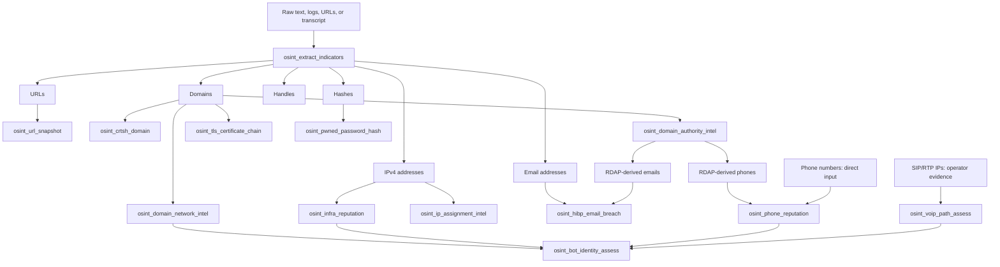

# OpenClaw OSINT

MIT-licensed standalone OpenClaw plugin for bounded public-source OSINT helpers.

This plugin is intentionally conservative. It provides useful public-source primitives without credentialed scraping, private data broker access, exploit checks, port scans, or shell execution.

## Flow

```mermaid
flowchart TD
  Request["User or agent request"] --> Plugin["OpenClaw OSINT plugin"]
  Plugin --> Extract["osint_extract_indicators"]
  Plugin --> Web["osint_url_snapshot"]
  Plugin --> Certs["osint_crtsh_domain"]
  Plugin --> Network["osint_domain_network_intel"]
  Plugin --> Authority["osint_domain_authority_intel"]
  Plugin --> Phone["osint_phone_reputation"]
  Plugin --> Voip["osint_voip_path_assess"]
  Plugin --> Infra["osint_infra_reputation"]
  Plugin --> IpRdap["osint_ip_assignment_intel"]
  Plugin --> Tls["osint_tls_certificate_chain"]
  Plugin --> Bot["osint_bot_identity_assess"]
  Plugin --> Hibp["HIBP tools"]
  Plugin --> CacheStatus["osint_cache_status"]
  Plugin --> Pipeline["osint_pipeline_recon"]

  Web --> Ssrfg["OpenClaw SSRF guard"]
  Certs --> Crtsh["crt.sh"]
  Network --> Dns["Local DNS"]
  Network --> Bgp["bgp.tools WHOIS"]
  Network --> IpRdap
  IpRdap --> Rir["IANA IP RDAP bootstrap + RIR RDAP"]
  Authority --> AuthDns["Authority DNS records"]
  Authority --> Rdap["IANA RDAP bootstrap + domain RDAP"]
  Phone --> Ftc["FTC DNC if configured"]
  Phone --> Leads["Telecom source leads"]
  Voip --> Observed["Operator-supplied SIP/RTP IPs"]
  Observed --> Bgp
  Infra --> Spamhaus["Spamhaus DROP"]
  Infra --> Abuse["AbuseIPDB if configured"]
  Tls --> CertChain["TLS peer certificate chain"]
  Hibp --> HibpApi["Have I Been Pwned"]

  Crtsh --> Cache["SQLite OSINT cache"]
  Rdap --> Cache
  Rir --> Cache
  Bgp --> Cache
  Ftc --> Cache
  Spamhaus --> Cache
  HibpApi --> Cache
  CacheStatus --> Cache

  Leads --> Didww["DIDWW DID/prefix leads"]
  Leads --> Ovh["OVH authenticated inventory lead"]
  Leads --> Codes["Country-code references"]
  Leads --> Blocked["Blocked person-search surfaces"]

  Network --> Evidence["Bounded reputation/context evidence"]
  Authority --> Evidence
  Tls --> Evidence
  Authority --> Phone
  Authority --> Hibp
  Phone --> Evidence
  Voip --> Evidence
  Infra --> Evidence
  Evidence --> Bot
  Bot --> Guard["No private human identity resolution"]
  Blocked --> Guard
  Pipeline --> Extract
  Pipeline --> Web
  Pipeline --> Network
  Pipeline --> Infra
  Pipeline --> Hibp
```





Pipeline effort levels:

- `light`: extract indicators only, no network lookups
- `medium`: extract indicators, then enrich bounded URLs and domains
- `high`: extract indicators, enrich URLs/domains, then correlate TLS certificate chains, DNS-discovered IPs, RIR allocation records, and RDAP-derived emails/phones into reputation checks

## Tools

### `osint_extract_indicators`

Extracts indicators from supplied text without network access.

Returns:

- URLs
- domains
- IPv4 addresses
- email addresses present in the input
- social handles present in the input
- common cryptographic hashes

### `osint_url_snapshot`

Fetches one public HTTP(S) URL through OpenClaw's SSRF guard and returns bounded metadata:

- HTTP status and final URL
- content type
- page title
- description
- canonical URL
- bounded body excerpt wrapped as untrusted external content

### `osint_pipeline_recon`

Runs bounded recon from raw text by effort level:

- `light`: local indicator extraction only
- `medium`: URL snapshots and domain network intel
- `high`: medium plus TLS certificate chain inspection, authority DNS/RDAP, RIR IP assignment RDAP, infrastructure reputation for input or DNS-discovered IPs, HIBP email checks for input or RDAP-derived emails, phone reputation for RDAP-derived phone contacts, and pwned-password hash checks where indicators exist

The pipeline deduplicates indicators through `osint_extract_indicators`, applies `maxLookups` caps per indicator class, and returns stage-labeled results. HIBP email checks still require `HIBP_API_KEY`; missing keys return tool errors instead of blocking the rest of the pipeline. RDAP-derived contact indicators are reputation inputs only, not identity proof. `crt.sh` remains available through `osint_crtsh_domain`, but high-effort pipeline reports it as a deferred optional source because the public service is often slow or unavailable.

### `osint_crtsh_domain`

Looks up certificate transparency names for a public domain using `crt.sh`.

This is a standalone optional enrichment tool. `osint_pipeline_recon` does not call it by default because `crt.sh` frequently times out or returns transient gateway errors.

Returns:

- normalized domain observations
- confidence and source reference per observation
- cache status (`hit` or `refreshed`)
- bounded counts for returned and stored observations

The tool stores scoped observations in a local SQLite cache and drops names that do not match the requested domain suffix.

### `osint_domain_network_intel`

Resolves a domain and enriches the returned IPs with passive routing and allocation ownership data.

Sources and behavior:

- uses the local DNS resolver for A/AAAA records
- queries the supported bgp.tools WHOIS automation interface on TCP/43
- caches bgp.tools WHOIS rows locally
- returns ASN, BGP prefix, country, registry, allocation date, and AS name per IP
- resolves the responsible RIR through IANA IPv4/IPv6 RDAP bootstrap data
- fetches RIR RDAP allocation records from ARIN, APNIC, RIPE NCC, LACNIC, AFRINIC, or the bootstrap-selected registry
- returns compact IP assignment summaries and bounded RDAP-derived contact indicators
- returns a correlated `summary` and `correlatedPaths` view joining DNS, BGP, IP assignment, and trace-plan data
- can include an operator-side traceroute plan
- does not run traceroute or shell commands itself

### `osint_ip_assignment_intel`

Looks up allocation data for an IPv4 or IPv6 address through the responsible Internet registry.

Sources and behavior:

- uses IANA IPv4/IPv6 RDAP bootstrap data to select the RIR endpoint
- supports ARIN, APNIC, RIPE NCC, LACNIC, AFRINIC, and other bootstrap-listed RDAP services
- returns compact allocation summary fields such as handle, name, country, start/end address, status, and events
- returns bounded RDAP-derived emails and phone contacts as reputation indicators
- caches bootstrap and allocation responses locally
- does not identify subscribers, devices, or private human owners

### `osint_tls_certificate_chain`

Inspects a public TLS endpoint's presented certificate chain.

Sources and behavior:

- connects with SNI using Node's TLS stack
- blocks localhost, internal hostnames, and private/special-use resolved IPs before connecting
- returns certificate subject, issuer, SANs, validity window, serial, fingerprints, and raw SHA-256 per chain entry
- returns TLS protocol and cipher metadata
- includes an `openssl s_client -showcerts` operator command for reproduction
- does not execute `openssl` or shell commands itself

### `osint_domain_authority_intel`

Walks safe domain authority sources for a host or domain.

Sources and behavior:

- infers the registered domain for common host input such as `www.example.com`
- uses the local DNS resolver for NS, SOA, MX, TXT, and CAA authority records
- resolves the TLD RDAP service through the IANA RDAP bootstrap
- fetches domain RDAP JSON through OpenClaw's SSRF guard
- returns a compact RDAP summary plus bounded derived email and phone indicators
- caches authority/RDAP output locally
- treats RDAP contacts as role/reputation indicators, not private ownership attribution

### `osint_cache_status`

Reports local OSINT cache counts and byte totals without exposing cached raw data.

### `osint_hibp_email_breach`

Checks an email address against Have I Been Pwned.

Requirements and behavior:

- requires `HIBP_API_KEY`
- sends the email address to HIBP
- stores cache entries under a SHA-256 email target key, not the raw email address
- returns breach names, domains, dates, data classes, and flags
- omits HIBP HTML descriptions from tool output
- includes HIBP attribution

### `osint_hibp_latest_breach`

Fetches the most recently added HIBP breach metadata. This is unauthenticated and can be used as a cheap preflight before account checks.

### `osint_pwned_password_hash`

Checks a SHA-1 or NTLM password hash against HIBP Pwned Passwords using the k-anonymity range API.

Requirements and behavior:

- accepts only SHA-1 or NTLM hashes
- rejects plaintext-like input
- sends only the first five hash characters to the API
- checks the suffix locally
- does not store searched hashes

### `osint_phone_reputation`

Checks a US phone number against FTC Do Not Call reported-call complaint data.

Requirements and behavior:

- works without API keys for local US phone normalization
- adds FTC complaint evidence when `FTC_API_KEY` is configured
- returns categorized source leads for public fraud-report and disposable/VoIP footprint checks
- returns numbering-plan context and source leads for DID inventory, country-code references, and authenticated operator inventory checks
- marks person-search and address-broker sources as blocked automation
- optionally accepts `organizationDomain` to correlate the number check with that domain's DNS/BGP network footprint
- supports US numbers only
- fetches a bounded recent area-code sample and matches the number locally
- returns complaint count, robocall count, subjects, dates, and caveats
- treats FTC reports, source leads, and network correlation as reputation/context evidence, not owner identity

### `osint_infra_reputation`

Checks IPv4 infrastructure against abuse reputation sources.

Sources:

- Spamhaus DROP IPv4 netblocks, cached locally
- AbuseIPDB, when `ABUSEIPDB_API_KEY` is configured

The result classifies service/spam infrastructure likelihood without identifying a private human owner.

### `osint_bot_identity_assess`

Combines explicit evidence into a bot/service identity assessment.

Inputs can include:

- platform bot/app/webhook metadata
- official service-source evidence
- phone complaint counts
- Spamhaus listing state
- AbuseIPDB confidence score

Outputs include owner-class hints, confidence, evidence, allowed actions, and blocked actions. Human identity resolution stays blocked even when spam/service evidence exists.

### `osint_voip_path_assess`

Assesses telecom-path mismatch risk from operator-supplied VoIP evidence.

Inputs can include:

- a US/NANP phone number
- observed SIP signaling IPs from SIP headers, SBC logs, or PBX logs
- observed RTP/media IPs from SDP, packet captures, or media logs
- optional claimed company/service domain for DNS/BGP context
- observed STIR/SHAKEN attestation (`A`, `B`, `C`, `none`, or `unknown`)

The tool enriches observed SIP/RTP IPs with BGP network ownership and country data, then scores mismatch risk. For example, a US number with non-US SIP/RTP network paths and weak/absent STIR/SHAKEN attestation is a high-risk signal. It does not identify subscribers, human owners, or law-enforcement traceback results.

Integrated telecom source leads:

- DIDWW NANPA prefix/API documentation and area-prefix directory as DID/VoIP inventory leads
- OVH telephony API as authenticated operator-owned inventory context only
- CountryCode.org, CountryAreaCode, and the Goles country-code gist as low-authority numbering-plan references
- NumInfo and other reverse-person lookup surfaces remain blocked automation

## Cache Behavior

The plugin uses a bounded local SQLite cache for cacheable public sources.

- default path: OpenClaw user state under `state/plugins/osint/osint.sqlite`
- override path: `OPENCLAW_OSINT_DB_PATH`
- `crt.sh` cache TTL: 24 hours
- bgp.tools WHOIS cache TTL: 6 hours
- HIBP email cache TTL: 24 hours
- HIBP latest breach cache TTL: 1 hour
- FTC phone reputation cache TTL: 6 hours
- Spamhaus DROP cache TTL: 12 hours
- per-source cache pruning: latest 250 source targets
- no shell execution, scanning, credentialed APIs, or private-data-broker lookups

## Install

```bash
pnpm install
pnpm build
pnpm pack
openclaw plugins install ./openclaw-osint-0.10.1.tgz
```

Restart the OpenClaw gateway after install.

## Build And Test

```bash
pnpm install
pnpm build
pnpm test
```

## Versioning

Use `v<major>.<feature>.<patch>` git tags. Keep the tag, `package.json` version, and `openclaw.plugin.json` version aligned.
